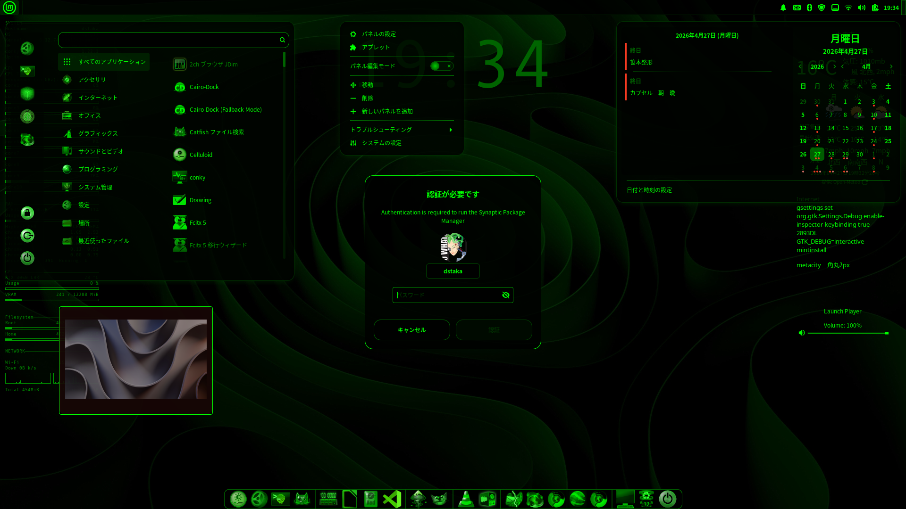
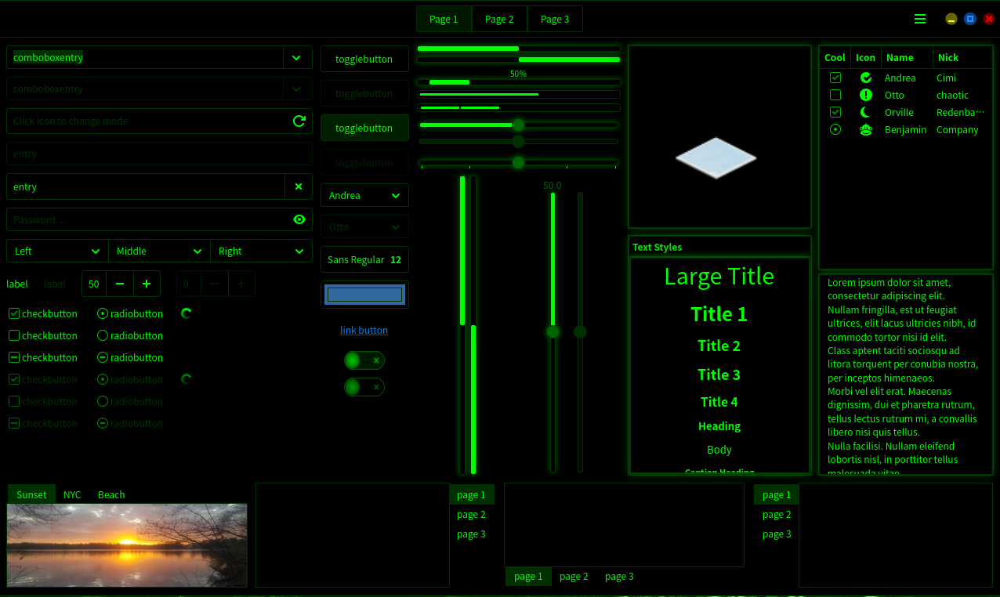

# Cinnamon Hacker Theme

A dark theme for Cinnamon, based on "Pure Black and Neon Green."

## Version: 2.0

## What's New in v2.0
- **GTK 2.0 & 3.0 Support:** Added fully optimized styling for legacy and current GTK applications, ensuring a consistent cyber look across the desktop.
- **GTK 4.0 Support:** Fully implemented cohesive styling for modern application layers, featuring a unified solid flat black alignment and maximum neon green responsiveness.
- **Cinnamon Shell Bugfixes:** Fine-tuned core shell elements to prevent alignment issues and maintain rigid grid balance.
- **Graphic Assets:** Optimized SVG assets for improved consistency and reduced file size.

## Screenshots

### GTK 2 / GTK 3 Applications


### GTK 4 Applications


## Recommended Icon Theme

For the complete cyber look shown in the screenshots, it is recommended to use the Dedicated to Hackerer icon theme.

Download:
• GitHub: https://github.com/dstakaroot/Dedicated-to-Hackerer
• OpenDesktop: https://www.opendesktop.org/s/Gnome/p/2332618

## Installation

### For Single User:
Place the `cinnamon-Hacker` folder inside your local directory:
```bash
~/.themes/
```

### System-wide (Recommended):
Place the folder in the system theme directory to ensure the theme is applied consistently, including applications launched as root (e.g. Synaptic).
```bash
/usr/share/themes/
```

## Credits
- **SVG Assets:** Based on Tyr-jord's baseline graphic work.

## Author
- **dstakaroot**

## License
GPLv3


